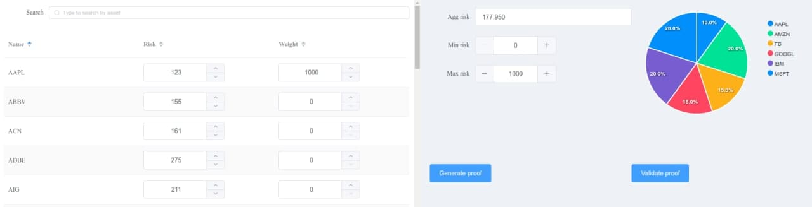

# ZKP applied to portfolio risk reporting

**This repo contains a proof of concept project made for the TON contest:**
[#32 Groth16 zkSNARK Proof Verification Use Cases Part II](https://devex.gov.freeton.org/proposal?proposalAddress=0%3A9da091db1d766a6de5309463b63e5120fe2ad8a36ee2a5aad3b537a7249662c0)



## Abstract

Nowadays there is an information asymmetry between investment funds and their clients. Clients don’t have the full information on their portfolio content and are not able to verify if the asset manager is going beyond their preferred risk limit. Funds keep their investment strategies confidential in order not to put their competitive advantage at risk.

We want to propose a Zero Knowledge Proof based solution for funds to perform risk reporting in a way that enables clients to verify the proof of portfolio weighted risk and be sure it's not beyond their limit.

## Blueprint cli tool

This tool allows to generate prover and verification keys, proofs and also verifies them. It has 2 different work modes - proof generation and proof verification modes.

In proof generation mode it takes csv file with weights and risks, minimal and maximal risks allowed by customer as inputs. Then it creates circuit, generates r1cs constraints, witness and generates key pair. Using generated key it creates proof and saves it to a specified file, along with verification key and marshalized primary input which can be used later in a proof verification mode.

In proof verification mode cli tool takes as inputs proof file, verification_key file and primary_input file paths. It deserealizes data from this files and verifies given proof. The result of verification is shown to a standard output.

## zkSNARK schema

Primary inputs:
* weights - vector of integers

Public inputs:
* risks - vector of integers
* minimal allowed risk - integer
* maximal allowed risk - integer

Under the hood circuit calculates aggregate risk as a inner product of weights and risks vectors. Then it checks that this aggregate risk is in a allowed range.

## Verification smart contract

The smart contract is available at `/contracts/verification.sol`. It allows to verify onchain given proof and primary input in hex format using new Groth16 instruction.

Contract workflow:

* deploy contract on chain
* set verification key using method `setVerificationKey` available only for contract owner
* verify proof using `verify` method which takes
* `serialize_primary_input` method can be used for encoding human readable inputs to bytes format and then using encoded result as an input for `verify` function


## Demo webapp

The demo app illustrates the idea using portfio from S&P 100 assets as an example. Its features:
* portfolio risks editing
* portfolio weights editing
* searching asset by its name
* aggregate risk calculation
* pie chart of portfolio risk allocation by assets
* private and public circuit inputs display
* interactive proof generation for given range of allowed risks
* interactive proof verification (using TestSuite4 library)


## Instructions

### Prerequirements

* For building the blueprint cli tool you'll need installed cmake and boost.
* For interacting with a contracts on blockchain emulator you'll need installed [TestSuite4](https://github.com/NilFoundation/TestSuite4) python package
* For running webapp you'll also need node, npm


### Blueprint cli tool
Clone contest repo:
```
git clone https://github.com/zealot72/ton-proof-verification-contest --recursive
```

Build cli tool:
```
mkdir build && cd build
cmake ..
make cli
```

Go to contracts directory:
```
cd ../contracts
```

Generate proof using prepared assets.csv file with risks and dummy weights
```
../build/bin/cli/cli --generate --assets "../assets.csv" -l 101 --min-risk 0 --max-risk 2000000
```

Output:
```
Loading assets from csv file ../assets.csv
Generating r1cs constraints...
Generating r1cs witness...
minRisk = 0
maxRisk = 2000000
aggRisk = 1779500
minRiskLess = 1
minRiskLessOrEq = 1
maxRiskLess = 1
maxRiskLessOrEq = 1
Blueprint primary_input size: 103
Blueprint auxiliary_input size: 273
Blueprint num_constraints: 176
Blueprint num_inputs: 103
Blueprint num_variables: 376
Blueprint satisfied: 1
Generating key pair...
Generating proof...
Saving proof to "proof"
Saving verification_key to "verification_key"
Saving primary input to "primary_input"
```

Verify generated proof offchain using Blueprint library:
```
../build/bin/cli/cli --verify
```

Output:
```
Deserializing proof from file "proof"
Deserializing verification key from file "verification_key"
Deserializing primary input from file "primary_input"
Verifying proof in blueprint...
Proof verification status: 1
```

### Verification smart contract

Compile verification contract with Nil's tvm-solidity compiler:
```
tondev sol compile verification.sol
```

Verify generated proof in blockchain emulator using TestSuite4 library:
```
python verify.py
```


Output:
```
Loading proof from file "proof"
Loading primary input from file "primary_input"
Loading verification key from file "verification_key"
Verifying proof on chain...
Proof verification status: True
```

### Demo webapp

Start backend server
```
cd /webapp/backend/
pip install -r requirements.txt
python app.py
```

Run frontend
```
cd /webapp/frontend/
npm install
npm run dev
```

Open http://localhost:3000/ in your browser


### Testing

Build and run tests:
```
cd build
cmake .. -DDBUILD_TESTS=1
make circuit_test
test/circuit_test
```
